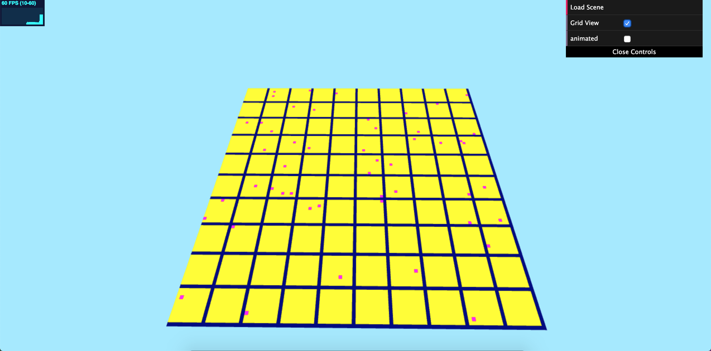

# Amy Chen // amyjchen

## Demo Link
https://merunicorn.github.io/hw06-city-generation/

### Terrain
Using the noise functions and modifications from the last HW (Worley Noise and FBM), I created a varied terrain with water and land. I then created two elevations (land vs water, with a slope between), as well as a matching color distinction, based on when the result of my noise was below a certain value, between a range, or above a certain value.

[]

### Grid
Using instanced rendering as implemented in previous assignments, I rendered squares (rotated along the x axis, as squares by default are rendered facing the camera) to form a grid over the area of the terrain. I set up a grid of 100x100 squares where my pseudo roads (shown in dark blue) were squares on every 10th position. I also set up a point scattering system using Math.random() (that avoids roads by not placing points in the same specification as just noted) - these are shown in purple. The rest of the area is shown in yellow.

[]

For this assignment, you will generate a collection of 3D buildings within the road networks you created for the previous assignment.

For this assignment, you will generate a network of roads to form the basis of a city using a modified version of L-systems. As in homework 4, you will be using instanced rendering to draw your road networks.

## Resources

Previous HWs, which included Adam's noise function code, as found in provided ShaderToy demos.
